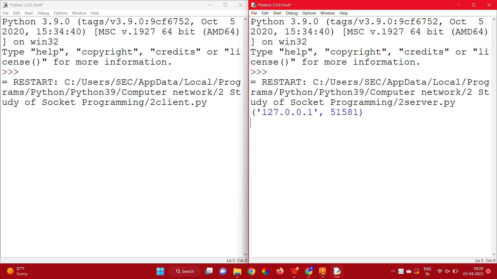

# 19CS406-EX-1 STUDY OF SOCKET PROGRAMMING WITH CLIENT-SERVER MODEL

# DATE :

# AIM :

To implement socket programming date and time display from client to
server using TCPSockets

# ALGORITHM :

## Server:
1. Create a server socket and bind it to port.
2. Listen for new connection and when a connection arrives, accept it.
3. Send server‟s date and time to the client.
4. Read client‟s IP address sent by the client.
5. Display the client details.
6. Repeat steps 2-5 until the server is terminated.
7. Close all streams.
8. Close the server socket.
9. Stop.
    
## Client:
1. Create a client socket and connect it to the server‟s port number.
2. Retrieve its own IP address using built-in function.
3. Send its address to the server.
4. Display the date & time sent by the server.
5. Close the input and output streams.
6. Close the client socket.
7. Stop.


# PROGRAM :

## CLIENT:
```
import socket
s=socket.socket()
s.bind(('localhost',8000))
s.listen(5)
c,addr=s.accept()
address={"165.165.80.80":"6A:08:AA:C2","165.165.79.1":"8A:BC:E3:FA"};
while True:
    ip=c.recv(1024).decode()
    try:
        c.send(address[ip].encode())
    except KeyError:
        c.sent("Not Found".encode())
```
 
## SERVER:
```
import socket
s=socket.socket()
s.connect(('localhost',8000))
print(s.getsockname())
print(s.recv(1024).decode())
s.send("acknowledgement recived from the server".encode())
```

# OUTPUT:
Client:  Server:



# RESULT:
Thus, the program to implement socket programming date and time display from client to 
server using TCP Sockets was successfully executed.
